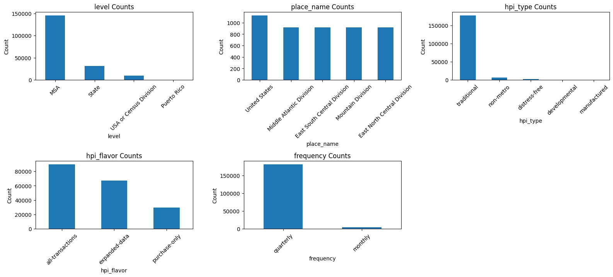
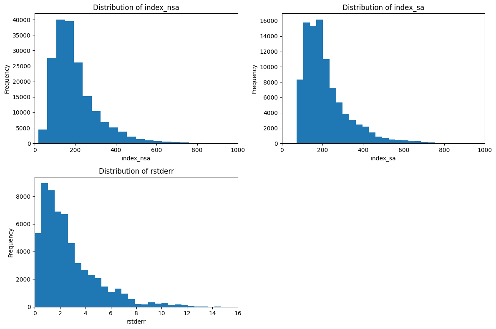
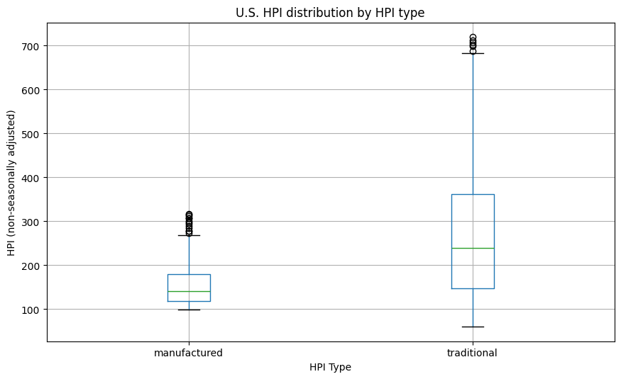
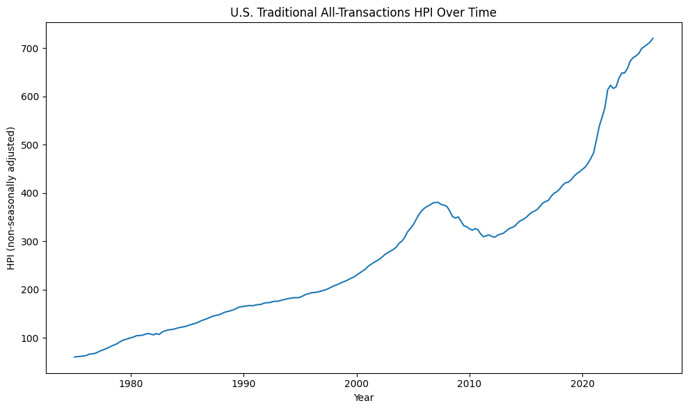

## DS 201 Capstone 1

**Authors:** Abby and Lilly

## 1. Understanding the Data

* When was the data acquired?

Data collection began in January 1975. The FHFA HPI dataset was last updated in August 2026.

* Where was the data acquired?

The data contains housing price indexes for geographic areas including the United States, Census Divisions, states, Metropolitan Statistical Areas (MSAs), and Puerto Rico.

* How was the data acquired?

The FHFA Housing Price Index is based on repeat mortgage transactions involving single-family properties handled by Fannie Mae and Freddie Mac. The master dataset combines current and historical data to provide HPI measurements over time.

* What are the attributes of this dataset? / What type of data do these attributes contain?

| Attribute | Data Type | Description |
|---|---|---|
| `hpi_type` | Nominal | Categorizes the type of HPI product. |
| `hpi_flavor` | Nominal | Categorizes how the HPI was calculated. |
| `frequency` | Categorical | Indicates whether the HPI is reported monthly or quarterly. |
| `level` | Nominal | Geographic level at which the HPI is measured. |
| `place_name` | Nominal | Name of the geographic region. |
| `place_id` | Nominal | Identifier for the geographic region. |
| `yr` | Interval | Year in which the HPI was measured. |
| `period` | Categorical/ordinal code | Month or quarter associated with the observation. |
| `index_nsa` | Interval | Non-seasonally adjusted HPI index. |
| `index_sa` | Interval | Seasonally adjusted HPI index. |
| `rstderr` | Ratio | Repeat-sales standard error. |
| `note` | Nominal | Notes about observations for which FHFA did not have sufficient sales data. |

## 2. Exploratory Data Analysis

### Summary statistics

|       |          yr |   index_nsa |   index_sa |     rstderr |
|:------|------------:|------------:|-----------:|------------:|
| count | 186011      |  186011     |  96114     | 58220       |
| mean  |   2006.16   |     199.962 |    216.67  |     2.67325 |
| std   |     12.0044 |     116.125 |    113.513 |     2.22215 |
| min   |   1975      |      18.6   |     72.78  |     0       |
| 25%   |   1997      |     119.61  |    137.29  |     1.06    |
| 50%   |   2007      |     172.13  |    187.21  |     2.05    |
| 75%   |   2016      |     241.38  |    258.337 |     3.6     |
| max   |   2026      |    1326.94  |   1043.2   |    15.75    |

### Mode of categorical variables

|    | level   | place_name    | hpi_type    | hpi_flavor       | frequency   |
|---:|:--------|:--------------|:------------|:-----------------|:------------|
|  0 | MSA     | United States | traditional | all-transactions | quarterly   |

#### Counts of month and quarter codes (period).

Because period represents a month or quarter code rather than a continuous numerical variable, describing the variable with frequencies is more appropriate than using the mean and standard deviation.

|                  |   count |
|:-----------------|--------:|
| ('monthly', 1)   |     360 |
| ('monthly', 2)   |     360 |
| ('monthly', 3)   |     360 |
| ('monthly', 4)   |     360 |
| ('monthly', 5)   |     360 |
| ('monthly', 6)   |     360 |
| ('monthly', 7)   |     350 |
| ('monthly', 8)   |     350 |
| ('monthly', 9)   |     350 |
| ('monthly', 10)  |     350 |
| ('monthly', 11)  |     350 |
| ('monthly', 12)  |     350 |
| ('quarterly', 1) |   45844 |
| ('quarterly', 2) |   45977 |
| ('quarterly', 3) |   44931 |
| ('quarterly', 4) |   44999 |

### Handling missing data

|            |      0 |
|:-----------|-------:|
| hpi_type   |      0 |
| hpi_flavor |      0 |
| frequency  |      0 |
| level      |      0 |
| place_name |      0 |
| place_id   |      0 |
| yr         |      0 |
| period     |      0 |
| index_nsa  |      0 |
| index_sa   |  89897 |
| rstderr    | 127791 |
| note       | 127791 |

One strategy to handle these missing values (marked as NaN in pandas) is to drop all the rows with empty values (using hpi.dropna()). This is simple and keeps only the rows with fully complete data, but because there are 89,897 missing values for column index_sa and 127,791 missing values for columns rstderr and note, we would be throwing away nearly all of the data.

Another solution is to drop the columns that have the most missing values. For example, the column called note. This may be more reasonable because note only has values for a few rows, minimizing how much data gets dropped from the dataset.

A final option could be filling in the missing values for index_sa with the mean or median of the column. While this would retain the most data for analysis, it would also flatten the natural variation in the data that misleadingly makes the data look more uniform than actually is. Additionally, the majority of seasonally-adjusted HPIs are calculated for state HPIs. Using the mean and median from seasonally-adjusted state HPIs may then wrongly assume that a house from USA or Census Division level will have a similar seasonally-adjusted HPI.

## Visualizations

### Figure 1: Bar charts of categorical variable counts

These visualizations are consistent with the calculation of the mode. Note that Puerto Rico and many of the numbers corresponding to monthly periods do not show up on the graph due to the y-axis intervals, but values for these levels do exist.

### Figure 2: Histograms of numeric attributes

The three numeric attributes are positively skewed.

### Figure 3: Boxplot of U.S. HPI distribution by HPI type

The distribution of traditional HPIs is more spread out than manufactured HPIs for this dataset. There are several observations for both U.S. HPI types beyond the upper whiskers, which could indicate potential outliers. Compared to the traditional HPIs, the manufactured HPIs are more closely clustered together.

### Figure 4: Line graph for U.S. traditional all-transactions non-seasonally adjusted quarterly HPI over time

Based on this visualization showing the changes in this specific subset of HPIs over time, the U.S. traditional, all-transactions, quarterly HPIs have generally increased since 1975. There is a noticeable decline beginning around 2007-2009, and more rapid growth that begins around 2019-2020. Non-seasonally adjusted HPI was chosen because it provides more observations in the dataset than seasonally adjusted HPI values, which contain substantially more missing data and are primarily available for only state-level HPIs.

### 3. Expanding Investment Knowledge

* Why would this dataset be useful?

This dataset would be useful because it provides more detailed information about historical trends in real estate on the state level and compares a given listing to other listings in the region. For instance, average_listing_price_yy provides the percent change in average listing price from the same month in the previous year.

* How could it complement the data you are currently analyzing?

This dataset could complement the FHFA HPI dataset by providing more context for a particular state’s housing market, including how long listings stay up and insights on average listing counts and prices throughout a certain state. This additional information could also be used to better understand and compare patterns in HPI between states.

* Provide a link to the additional dataset.

https://econdata.s3-us-west-2.amazonaws.com/Reports/Core/RDC_Inventory_Core_Metrics_State_History.csv

## 4. Conclusions

Overall, U.S. traditional, all-transactions, non-seasonally adjusted quarterly HPI shows a general increase since 1975. This trend is visualized in Fig. 4, with some sudden changes over time. For example, in Fig. 4 there is a noticeable decline around 2007-2009 and a period of rapid growth that begins around 2019-2020. These periods coincide, respectively, with the financial crisis and recession of 2008 and the COVID-19 pandemic, but cannot be said to be the causes of the changes in the graph. 

The three numeric attributes shown in Fig. 2 are positively skewed. Because the full dataset contains observations from multiple geographic levels, HPI types, flavors, and reporting frequencies, Figure 2 should be interpreted as showing the distribution of HPI observations rather than the distribution of individual home prices.
